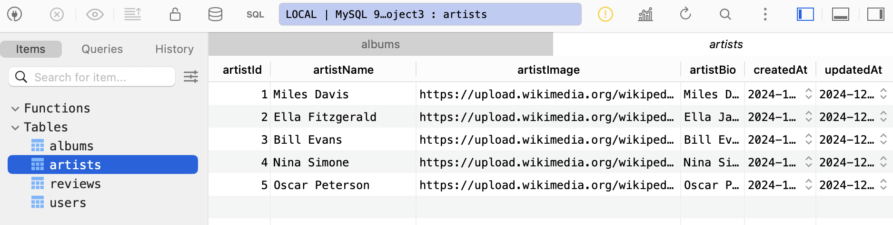

# 🎵 Album Reviewer Database

A backend-powered database for a social media-style platform where users can rate and review their favourite music albums. This project uses Sequelize ORM and MySQL to handle CRUD operations, relationships, and transactions between users, albums, artists, and reviews.

# Project Outline

The goal of this project was to design and implement a MySQL database integrated with a Node.js backend using Sequelize. The database consists of four related tables—albums, artists, users, and reviews—and showcases core backend development principles, including data validation, relationship mapping, foreign key constraints, transactions, and query optimization.

# Features

- Full CRUD functionality for albums, artists, users, and reviews
- One-to-many and many-to-many relationships between models
- Complex JOIN operations to retrieve nested relational data
- Transaction management for grouped data insertion
- Input validation and error handling
- Foreign key constraints with cascading deletes
- Modular architecture using Express routes and controllers

# Screenshots

_Albums_

_Artists_

_Reviews_

_Logical Model_

_Physical Model_

# Installation Instructions

- Clone and import the files within this GitHub project into your development environment
- Install relevant packages to run this project (sequelize, mysql)
- Update the .env with your database details
- Start the server
- Use ThunderClient or Postman to test the endpoints at http://localhost:8080

# Tech Stack

- Node.js & Express.js – Backend server
- MySQL – Relational database
- Sequelize – ORM for database interaction
- TablePlus – GUI for MySQL (optional)
- ThunderClient – API testing tool
- Draw.io – Used to design the ERD

# Testing Strategy

- All routes tested using ThunderClient
- Test data inserted using POST requests and verified via TablePlus
- CRUD functionality confirmed through GET, POST, PUT, DELETE endpoints
- Join operations tested via /details routes
- Transactions validated with /createWithReviews POST route
- Error handling tested with incorrect and missing inputs

# HTTP Request Methods

GET requests

<pre>
http://localhost:8080/api/albums
http://localhost:8080/api/artists
http://localhost:8080/api/reviews
http://localhost:8080/api/users
</pre>

POST requests

<pre>
http://localhost:8080/api/albums/create
http://localhost:8080/api/artists/create
http://localhost:8080/api/reviews/create
http://localhost:8080/api/users/create
</pre>

Album JSON example

<pre>
{
"albumId": 6,
"artistId": 1,
"albumTitle": "Round About Midnight",
"year": 1957,
"genre": "Jazz"
}
</pre>

PUT requests

<pre>
http://localhost:8080/api/albums/6
http://localhost:8080/api/artists/1
http://localhost:8080/api/reviews/1
http://localhost:8080/api/users/1
</pre>

Album JSON example

<pre>
{
"albumTitle": “Round About Midnight (Remastered)",
"year": 2020
}
</pre>

DELETE requests

<pre>
http://localhost:8080/api/albums/6
http://localhost:8080/api/artists/1
http://localhost:8080/api/reviews/1
http://localhost:8080/api/users/1
</pre>

Join Operation GET requests

<pre>
http://localhost:8080/api/albums/details
http://localhost:8080/api/artists/details
http://localhost:8080/api/reviews/details
http://localhost:8080/api/users/details
</pre>

Transaction POST requests

<pre>
http://localhost:8080/api/albums/createWithReviews
</pre>

Album JSON example

<pre>
{
"albumData": {
"albumTitle": "Round About Midnight",
"artistId": 1,
"year": 1957,
"genre": "Jazz"
},
"reviewsData": [
{
"userId": 2,
"rating": 5,
"review": "A masterpiece of jazz."
},
{
"userId": 3,
"rating": 4,
"review": "Iconic and timeless."
}
]
}
</pre>
